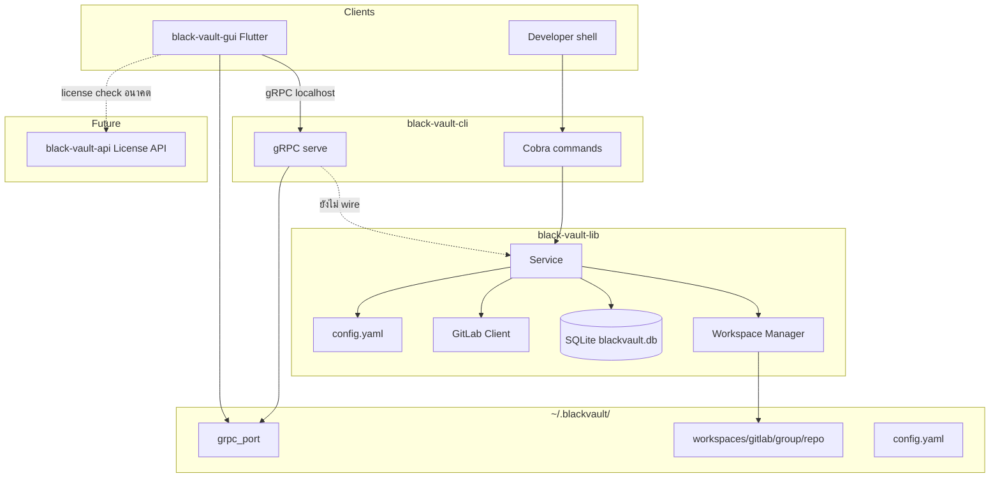

# Git BlackVault — สรุปผลิตภัณฑ์และแนวทางพัฒนาต่อ

> **Tagline:** *Open what you need. Burn the rest.*  
> เอกสารนี้สรุปจากโค้ดและ README ใน repo ทั้งหมด ณ วันที่กลับมาพัฒนาต่อ — ใช้เป็นแผนที่ก่อนลงมือ implement

---

## สารบัญ

1. [ระบบนี้คืออะไร](#1-ระบบนี้คืออะไร)
2. [สิ่งที่ระบบทำ / ไม่ทำ](#2-สิ่งที่ระบบทำ--ไม่ทำ)
3. [แผนที่ Repo ทั้งระบบ](#3-แผนที่-repo-ทั้งระบบ)
4. [สถาปัตยกรรมและการไหลของข้อมูล](#4-สถาปัตยกรรมและการไหลของข้อมูล)
5. [สถานะปัจจุบันแยกตาม Repo](#5-สถานะปัจจุบันแยกตาม-repo)
6. [พฤติกรรมหลัก (Runtime)](#6-พฤติกรรมหลัก-runtime)
7. [สัญญา gRPC](#7-สัญญา-grpc)
8. [ช่องว่างและ TODO ที่รู้แล้ว](#8-ช่องว่างและ-todo-ที่รู้แล้ว)
9. [แนะนำลำดับพัฒนาต่อ](#9-แนะนำลำดับพัฒนาต่อ)
10. [การตั้งค่าเครื่องพัฒนา](#10-การตั้งค่าเครื่องพัฒนา)
11. [อ้างอิงเอกสารอื่น](#11-อ้างอิงเอกสารอื่น)

---

## 1. ระบบนี้คืออะไร

**Git BlackVault** คือ **Workspace Manager** สำหรับ Git Repository แบบ **Ephemeral Workspace** — ไม่ใช่ Git GUI ทั่วไป และไม่ใช่เครื่องมือ sync/backup

| แนวคิด | ความหมาย |
|--------|----------|
| **เปิด (Open)** | Clone repo ลงโฟลเดอร์ชั่วคราวใต้ `~/.blackvault/workspaces/` แล้วทำงานตามปกติ |
| **ใช้งาน (Active)** | มีโฟลเดอร์บนดิสก์ + บันทึกใน registry ว่า `active` |
| **ปิด (Close)** | ลบโฟลเดอร์ทั้งหมด 100% — ไม่เหลือ working copy |
| **Registry** | SQLite จำประวัติว่าเคยเปิด repo ไหน สถานะ `active` / `closed` และ metadata |

เป้าหมายผู้ใช้: ทำงานกับหลาย repo จาก GitLab โดยไม่ต้อง clone ค้าง 20–30 โปรเจกต์, แยก context งานชัด, เครื่องโล่ง, backup ง่าย, ลดความเสี่ยงข้อมูลค้างบนดิสก์

> **คำเตือนสำคัญ:** ก่อน `close` ต้อง **push เอง** — ระบบไม่ sync NAS, ไม่ backup อัตโนมัติ

---

## 2. สิ่งที่ระบบทำ / ไม่ทำ

### ทำ (MVP / ที่ implement แล้วบางส่วน)

- จัดการ lifecycle workspace: `open`, `close`, `status`
- โคลนด้วย system git, portable git, หรือ go-git (fallback)
- ตัวเลือก clone: shallow, branch-specific (`OpenOptions`)
- Registry SQLite: รายการ repo, `last_opened`, สถานะ
- Config YAML: GitLab URL/token, workspace path, `git_path`
- CLI ครอบคลุมคำสั่ง Git หลายอย่าง (commit, branch, merge, remote, git-flow ฯลฯ) โดยอ้าง `[group/repo]` เป็น workspace id
- Desktop GUI (Flutter): ธีมขาว–ดำ, ไทย/อังกฤษ, placeholder เชื่อม gRPC
- สัญญา gRPC (`BlackVaultService`) ระหว่าง CLI ↔ GUI
- API แยก (.NET): โมเดล **License** สำหรับขาย/activate ซอฟต์แวร์ (ยังไม่มี endpoint จริง)

### ไม่ทำ (ตาม vision)

- Git GUI แบบ GitHub Desktop
- Sync กับ NAS / cloud drive
- Backup workspace อัตโนมัติ
- ผูก lifecycle repo กับเครื่องแบบถาวร (เมื่อ close แล้วไม่มีไฟล์)

---

## 3. แผนที่ Repo ทั้งระบบ

```
group-black-vault/
├── black-vault/          ← เอกสาร + concept (repo นี้)
├── black-vault-lib/      ← Go library — logic หลัก, proto source of truth
├── black-vault-cli/      ← Cobra CLI + gRPC serve (consumer ของ lib)
├── black-vault-gui/      ← Flutter desktop — gRPC client
└── black-vault-api/      ← ASP.NET Core — License / activation (คนละชั้นกับ workspace)
```

| Repo | บทบาท | ใครเรียกใคร |
|------|--------|-------------|
| **black-vault** | Vision, readme, เอกสารผลิตภัณฑ์ (`docs/PRODUCT.md`) | อ้างอิงโดยทุก repo |
| **black-vault-lib** | `Service`: Open/Close/Status/ListRepositories, config, workspace, store, GitLab client | ถูก import โดย CLI (`replace => ../black-vault-lib`) |
| **black-vault-cli** | คำสั่ง shell + `serve` (gRPC) | เรียก lib; GUI เรียก gRPC |
| **black-vault-gui** | UI desktop | อ่าน `~/.blackvault/grpc_port`, เรียก `BlackVaultService` |
| **black-vault-api** | Backend ใบอนุญาต (Customer / License / LicenseActivation) | อนาคต: CLI/GUI ยืนยัน `license_key` + `machine_id` |

**กฎสำคัญเมื่อแก้โค้ด**

- Logic workspace/registry/git **อยู่ที่ lib** — ห้าม duplicate ใน CLI
- แก้ `api/proto/blackvault.proto` ที่ **lib** แล้ว sync ไป CLI + GUI และ regenerate ทั้งสองฝั่ง
- คอมเมนต์ใน Go CLI เป็นภาษาไทย (ตาม convention ที่มีอยู่)

---

## 4. สถาปัตยกรรมและการไหลของข้อมูล



### ชั้นความรับผิดชอบ

| ชั้น | หน้าที่ |
|------|--------|
| **Workspace Manager** | สร้าง/ลบ path, `ListActive()` จาก disk |
| **Service** | Open (clone), Close, Status (รวม disk + DB), ListRepositories |
| **Store** | SQLite `repos` + `cache` |
| **Git Provider** | GitLab token, `CloneURLFor`, `ListProjects` (stub) |
| **Safety Guard** | วางแผน: dirty check ก่อน close — **ยังไม่ implement** |

---

## 5. สถานะปัจจุบันแยกตาม Repo

### 5.1 black-vault-lib (หัวใจระบบ)

**พร้อมใช้งาน**

| ส่วน | รายละเอียด |
|------|------------|
| `internal/config` | โหลด/บันทึก `~/.blackvault/config.yaml`, `ResolveGitPath` (config → PATH → portable) |
| `internal/workspace` | Path `workspaces/gitlab/<group>/<repo>`, CreateDir, Remove, ListActive |
| `internal/store` | SQLite pure-Go (`modernc.org/sqlite`), ตาราง `repos`, `cache` |
| `Service.Open` | Clone ผ่าน `git` CLI หรือ go-git; shallow/branch; ถ้ามี repo อยู่แล้วเปิดซ้ำได้ |
| `Service.Close` | ลบโฟลเดอร์ + ตั้ง status `closed` |
| `Service.Status` | Active จาก disk + closed จาก DB ที่ไม่มีบน disk |
| `Service.ListRepositories` | อ่านจาก store |
| `api/proto/blackvault.proto` | นิยาม RPC: OpenWorkspace, CloseWorkspace, GetStatus, ListRepositories, Ping |

**ยังไม่ครบ**

- `StatusEntry.Dirty` คงเป็น `false` เสมอ (ไม่ตรวจ uncommitted/unpushed)
- `gitlab.ListProjects` เป็น stub (ต้องมี token แต่ยังไม่เรียก API จริง)
- `OpenOptions.Detached` ยังไม่เห็น logic ใน `Open`
- ไม่มี Safety Guard ก่อน `Close` (แม้ proto มี `force`)

### 5.2 black-vault-cli

**พร้อมใช้งาน (ผ่าน lib)**

- `open [group/repo]` — `--shallow`, `--branch`, `--detached`
- `close [group/repo]` — `--force` (ส่งไป lib แต่ lib ยังไม่ใช้ force กับ dirty)
- `status`
- `config get|set`, `install-git`
- คำสั่ง Git จำนวนมาก: `git-commit`, `git-add`, `git-fetch`, `git-pull`, `git-push`, `git-branch-*`, `git-merge`, `git-remote`, `git-flow` (ทุกคำสั่งใช้ `[group/repo]` เป็น workspace id)
- CI: build matrix 6 แพลตฟอร์ม, release tag `v0.1.0` บน `main`

**ยังไม่ครบ**

- `serve` — **placeholder**: bind port, เขียน `grpc_port`, แต่ **ยังไม่ register `BlackVaultService`** และไม่มี generated `.pb.go` ใน repo (ต้อง `make proto`)
- Generated proto ไม่ได้ check-in

### 5.3 black-vault-gui

**พร้อมใช้งาน**

- โครง Flutter desktop (ตาม README ต้อง `flutter create` สำหรับ `windows/`, `linux/`, `macos/` ถ้ายังไม่มี)
- `resolveGrpcPort()` อ่าน `~/.blackvault/grpc_port`
- ธีม: ขาว / ดำ / grey เท่านั้น (`app_theme.dart`)
- i18n: ไทย (default) + English (`app_strings.dart`)

**ยังไม่ครบ**

- Connect ใช้ `Future.delayed` แทน gRPC จริง
- ไม่มี `lib/src/generated/` (ต้อง `make proto`)
- ไม่มีหน้า Open/Close/List repos
- ไม่มี service layer แยกจาก widget

### 5.4 black-vault-api

**พร้อมใช้งาน (โครงสร้าง)**

- Solution .NET 10: `Api → Data → Core`
- Entities: `Customer`, `License`, `LicenseActivation` + `ModelBase` (audit, soft delete)
- Environments: Local / Development / Staging / Production
- โมเดล license: ประเภท Trial/Standard/Professional/Enterprise, สถานะ Active/Expired/Suspended/Revoked, `max_activations`, `machine_id` สำหรับ activation

**ยังไม่ครบ**

- `BlackVaultContext` ยังไม่ใช่ `DbContext` จริง
- ไม่มี connection string / migration
- Controller มีแค่ `WeatherForecastController` (placeholder)
- ไม่มี endpoint activate/validate license
- ยังไม่เชื่อมกับ CLI/GUI

### 5.5 black-vault (repo เอกสาร)

- `readme.md` — concept, MVP features, architecture, task list เดิม
- `docs/PRODUCT.md` — เอกสารนี้

---

## 6. พฤติกรรมหลัก (Runtime)

### โครงสร้างบนเครื่องผู้ใช้

```
~/.blackvault/
├── config.yaml          # gitlab_token, gitlab_url, workspace_dir, git_path
├── blackvault.db        # SQLite: repos + cache
├── grpc_port            # พอร์ตที่ serve ใช้ (สร้าง/ลบตอน serve รัน)
├── cache/               # (ตาม config)
├── tools/git/           # portable git (optional)
└── workspaces/
    └── gitlab/
        └── <group>/
            └── <repo>/    # มีเฉพาะตอน active
```

### Open

```bash
blackvault open group/repo
blackvault open group/repo --shallow --branch main
```

1. Normalize path เป็น `group/repo`
2. สร้างโฟลเดอร์เป้าหมาย
3. ถ้าเป็น git repo อยู่แล้ว → คืน path, อัปเดต store เป็น `active`
4. ไม่มี → clone (system git หรือ go-git) จาก `CloneURLFor` หรือ default `https://gitlab.com/<path>.git`
5. `UpsertRepo` ใน SQLite

### Close

```bash
blackvault close group/repo
blackvault close group/repo --force   # ยังไม่กัน dirty ใน lib
```

1. `RemoveAll` workspace directory
2. `SetRepoStatus(..., "closed")`

### Status

```bash
blackvault status
```

- **ACTIVE:** ทุก path ที่ `ListActive()` เจอบน disk
- **CLOSED:** แถวใน `repos` ที่ไม่มีบน disk

### Serve + GUI

```bash
# Terminal 1
blackvault serve --port 50051   # ลอง 50051..50070 ถ้าชน

# Terminal 2
flutter run -d macos            # หลัง wire gRPC
```

GUI อ่านพอร์ตจาก `~/.blackvault/grpc_port` — **อย่า hardcode 50051** ในโค้ดใหม่

### Git path

ลำดับ: `config.git_path` → `git` บน PATH → `~/.blackvault/tools/git` → go-git (ใน lib เท่านั้นสำหรับ clone; คำสั่ง git-* ใน CLI ใช้ git ใน workspace)

---

## 7. สัญญา gRPC

ไฟล์ต้นฉบับ: `black-vault-lib/api/proto/blackvault.proto` (copy ที่ CLI/GUI)

| RPC | ความหมาย |
|-----|----------|
| `OpenWorkspace` | clone + คืน `workspace_path` |
| `CloseWorkspace` | ลบ directory (`force` = ข้าม dirty เมื่อ implement) |
| `GetStatus` | รายการ `active` / `closed`, `dirty` |
| `ListRepositories` | จาก registry (+ อนาคตจาก GitLab cache) |
| `Ping` | health / version |

เมื่อ implement server ใน CLI ให้ delegate ไป `blackvault.Service` โดยตรง — ไม่ duplicate business logic

---

## 8. ช่องว่างและ TODO ที่รู้แล้ว

| ลำดับความสำคัญ | รายการ | Repo หลัก |
|----------------|--------|-----------|
| P0 | Wire `serve` + generate proto + gRPC handler | cli, lib (proto) |
| P0 | GUI: service layer + เรียก RPC จริง | gui |
| P1 | Dirty state ก่อน close + ใช้ `force` | lib, cli |
| P1 | GitLab `ListProjects` + cache ใน `store.cache` | lib |
| P1 | หน้า GUI: รายการ repo, open/close, status | gui |
| P2 | Detached/review mode ใน `Open` | lib |
| P2 | Safety warnings (unpushed) | lib |
| P2 | Desktop scaffold (`flutter create --platforms=...`) ถ้ายังไม่มี | gui |
| P3 | License API + เชื่อม activation จาก CLI/GUI | api |
| P3 | Phase 2 features (auto-close, profiles, IDE integration) | หลาย repo |

รายการ task เดิมใน `readme.md` §11 ยังใช้ได้เป็น checklist สั้น ๆ

---

## 9. แนะนำลำดับพัฒนาต่อ

เมื่อกลับมาพัฒนา แนะนำเส้นทาง **Hybrid แต่เน้น CLI-first ให้ backend พร้อมก่อน GUI**

### เฟส A — ทำให้ “ระบบทำงานครบวงจร” (1–2 สัปดาห์)

1. **Proto & serve (CLI)**  
   - ติดตั้ง protoc, `make proto` ใน `black-vault-cli`  
   - Implement gRPC server ใน `cmd/serve.go` ครอบ `Open` / `Close` / `GetStatus` / `ListRepositories` / `Ping`  
   - ทดสอบด้วย `grpcurl` หรือ integration test

2. **GUI เชื่อมจริง**  
   - `make proto` ใน GUI → `lib/src/generated/`  
   - สร้าง `BlackVaultGrpcClient` (หรือเทียบเท่า) ใช้ `resolveGrpcPort()`  
   - แทน placeholder ใน `main.dart` ด้วย `Ping` + `GetStatus`

3. **Smoke test วงจร**  
   - `serve` → GUI Connect → `open` จาก GUI หรือ CLI → `status` เห็น active → `close` → โฟลเดอร์หาย

### เฟส B — ความปลอดภัยและ GitLab (2–3 สัปดาห์)

4. **Dirty detection** ใน lib (`git status`, ahead/behind)  
5. **Close confirmation** ใน CLI (`--force`) และ GUI (dialog)  
6. **GitLab ListProjects** + บันทึก cache → แสดงใน GUI / `ListRepositories`

### เฟส C — ผลิตภัณฑ์พร้อมขาย (ขนานได้)

7. **black-vault-api**: EF Core + PostgreSQL, endpoints `activate` / `validate`  
8. **CLI/GUI**: ส่ง `license_key` + `machine_id` ตอน startup (ออกแบบ UX ไม่รบกวนทุกคำสั่ง)

### เฟส D — Phase 2 (ตาม vision ใน readme)

- Workspace profiles (dev / review / hotfix)  
- Auto-close หลัง idle  
- IDE integration (VS Code / Cursor)

---

## 10. การตั้งค่าเครื่องพัฒนา

### Layout โฟลเดอร์ (จำเป็น)

```
<parent>/
├── black-vault/
├── black-vault-lib/
├── black-vault-cli/    # go.mod: replace => ../black-vault-lib
└── black-vault-gui/
```

CLI **จะ build ไม่ผ่าน** ถ้าไม่มี `black-vault-lib` เป็น sibling

### คำสั่งที่ใช้บ่อย

```bash
# Lib
cd black-vault-lib && go test ./...

# CLI
cd black-vault-cli && make build && go test ./...

# GUI
cd black-vault-gui && flutter pub get && flutter analyze

# API
cd black-vault-api && dotnet build BlackVault.slnx
```

### Regenerate proto (เมื่อแก้สัญญา)

1. แก้ `black-vault-lib/api/proto/blackvault.proto`  
2. Copy/sync ไป `black-vault-cli/api/proto/` และ `black-vault-gui/protos/`  
3. `make proto` ใน CLI และ GUI

---

## 11. อ้างอิงเอกสารอื่น

| เอกสาร | ที่อยู่ |
|--------|--------|
| Concept & MVP features | [readme.md](../readme.md) |
| Lib API & store | [black-vault-lib/README.md](../../black-vault-lib/README.md) |
| CLI commands | [black-vault-cli/README.md](../../black-vault-cli/README.md) |
| GUI setup | [black-vault-gui/README.md](../../black-vault-gui/README.md) |
| License domain | [black-vault-api/README.md](../../black-vault-api/README.md) |
| Agent conventions | `CLAUDE.md` ในแต่ละ repo |

---

## สรุปหนึ่งย่อหน้า

**BlackVault** จัดการ **ชีวิตของ working copy** แบบชั่วคราว: เปิดแล้ว clone, ปิดแล้วลบ, จำประวัติใน SQLite — ผ่าน **CLI (Cobra + lib)** และ **GUI (Flutter + gRPC)** โดย logic อยู่ที่ **lib** เท่านั้น **API (.NET)** เตรียมระบบ **ใบอนุญาต** แยกต่างหาก งานที่คุ้มที่สุดตอนกลับมาพัฒนาคือ **ทำให้ gRPC serve + GUI เชื่อมครบ**, จากนั้น **dirty check + GitLab registry**, แล้วค่อย **license activation**
